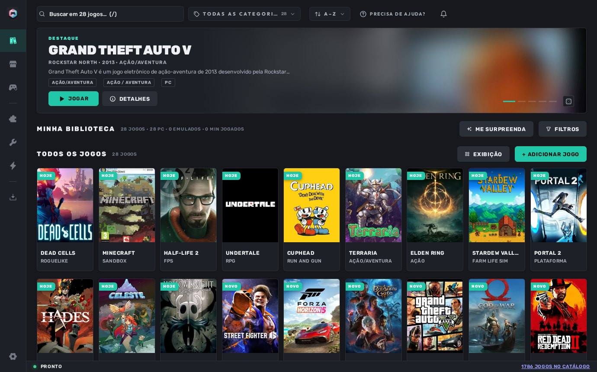

<p align="center"></p>
<h1 align="center">LudrixHub</h1>
<p align="center">Portable game launcher for Windows.<br>One library for PC, emulated and quick games · a Store fed by lists you choose · ready-to-use emulators · themes · Console Mode.</p>
<p align="center">
  <a href="https://github.com/wolffZ-prog/Ludrix/releases/latest"></a>
  <a href="https://github.com/wolffZ-prog/Ludrix/releases"></a>
  
  <a href="LICENSE"></a>
</p>
<p align="center"><a href="README.md">Português</a></p>
<p align="center"></p>

## Download

| File | What it is |
|---|---|
| **`Ludrix-<version>.zip`** | Ready to run. Extract anywhere (USB stick works), open `Ludrix.exe`. Nothing is installed system-wide. |
| `ludrix-<version>-patch.lxup` | Update package. Ludrix downloads and applies it from **Settings → System → Check for updates**; dropping the file on the window also works. |
| `Ludrix-<version>-src.zip` | Source of the same version, builds with `build.bat`. |

Latest: **[Releases](https://github.com/wolffZ-prog/Ludrix/releases/latest)**. Requirements: Windows 10/11 64-bit. Uses the Windows WebView2 Runtime (already on the system; installed automatically on first run if missing). No account, no login.

## Features

- **Library** — PC games (`.exe`, shortcuts, whole folders), ROMs and quick Flash/HTML5 games in one place. Covers, metadata, screenshots and system requirements fetched automatically and editable. Imports from Playnite, Steam, Epic, GOG, Ubisoft Connect, EA app, Battle.net, Amazon Games and itch.io. Names you type are never changed.
- **Store by sources** — no download source is built in. Add `.json` lists, web pages, archive.org collections, GitHub repositories or local folders and the Store shows what they offer. Direct links, file hosts (MEGA, MediaFire, Pixeldrain, Google Drive, itch.io…) and torrents; staged downloads, pause, queue with history. Installs what it downloads: archives, installers, disc images.
- **Recompilations** — native ports (N64, Xbox 360, PS1…) straight from GitHub, always the latest release. Ready list: `Recomps.json` (91 projects).
- **Emulators** — 25 systems, 45 emulators catalogued, installed from official sites into the Ludrix folder. Point a ROM folder per console and the games join the Library.
- **Central** — missing runtimes (Visual C++, DirectX, .NET, PhysX…), Game Mode, useful tools via winget / Microsoft Store, Minecraft launcher detection.
- **Console Mode** — separate TV/controller interface with the same tabs.
- **Appearance** — light/dark, accent, side or bottom bar, adaptive scale, importable `.lxtheme` themes made with Ludrix Studio (a separate program by the same author, not part of this repository). Portuguese (Brazil) and English.
- **System** — truly portable (`data/`, `games/`, `emulation/`, `downloads/`, `themes/` all inside the folder), tray, optional autostart, single instance, self-repair on boot, signed updates (Ed25519) with automatic rollback, full library export/import.

## Build

```bat
git clone https://github.com/wolffZ-prog/Ludrix.git
cd Ludrix
pip install -r requirements.txt
run.bat                       :: run without building
build.bat                     :: release\<version>\Ludrix\ + zips + .lxup
```
Python 3.11–3.14 on Windows. See `docs/` (Portuguese) for sources format, themes, updates and security notes.

## Credits

**WOLFFZ — creator and designer of the project.** MIT License. Games, covers and trademarks belong to their owners; Ludrix does not distribute games.
