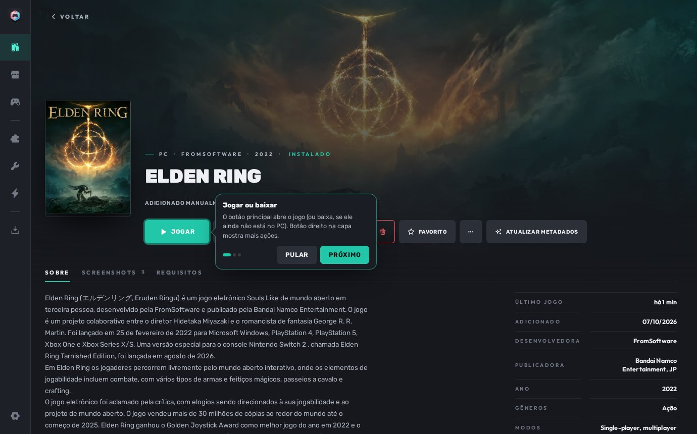
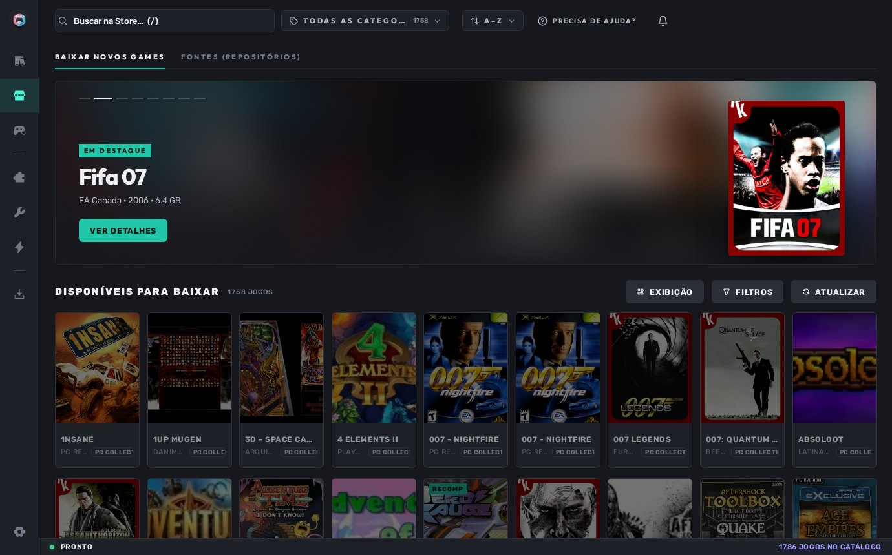
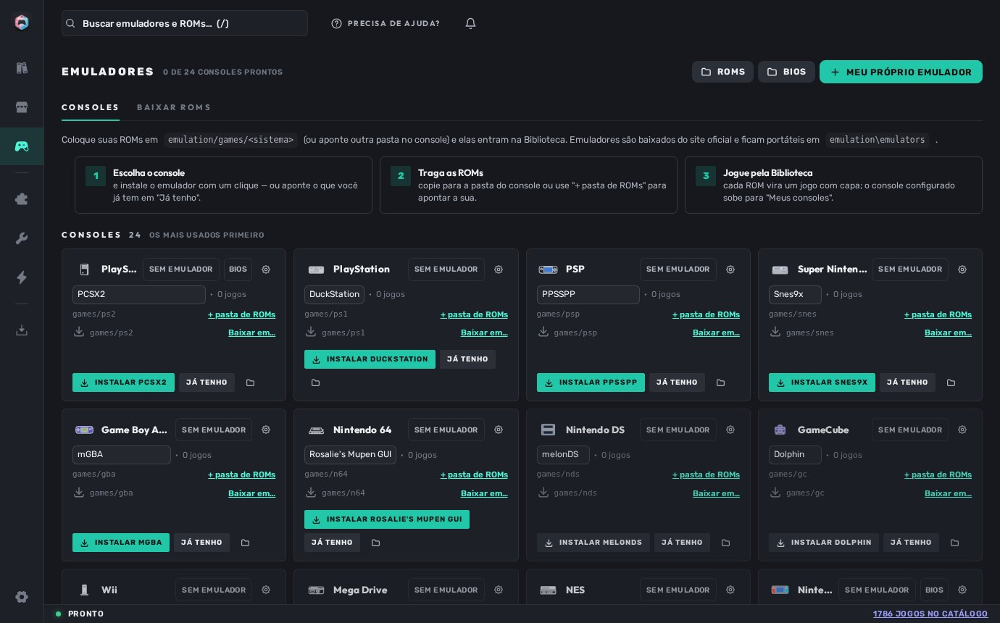
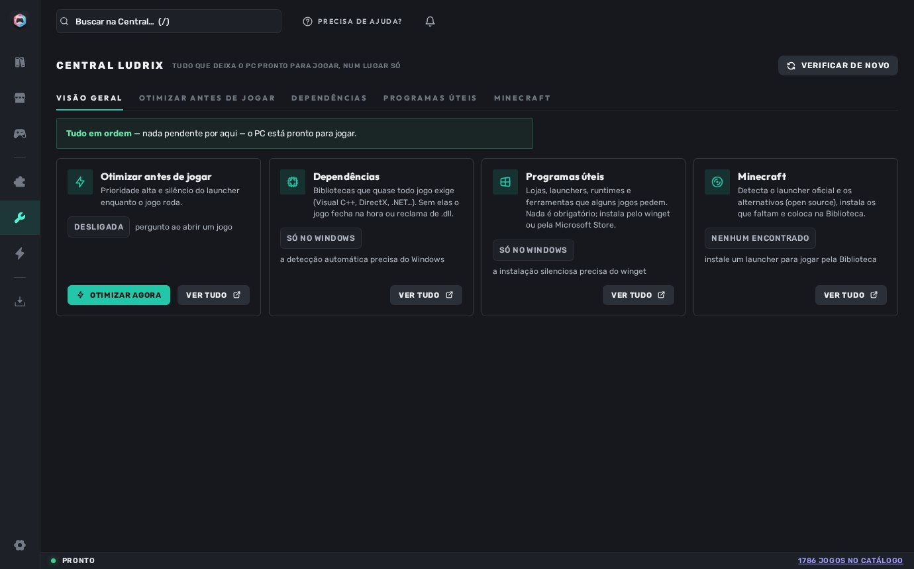
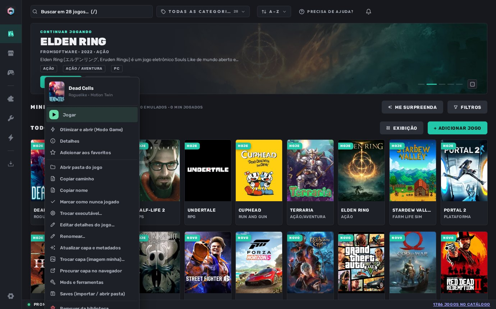
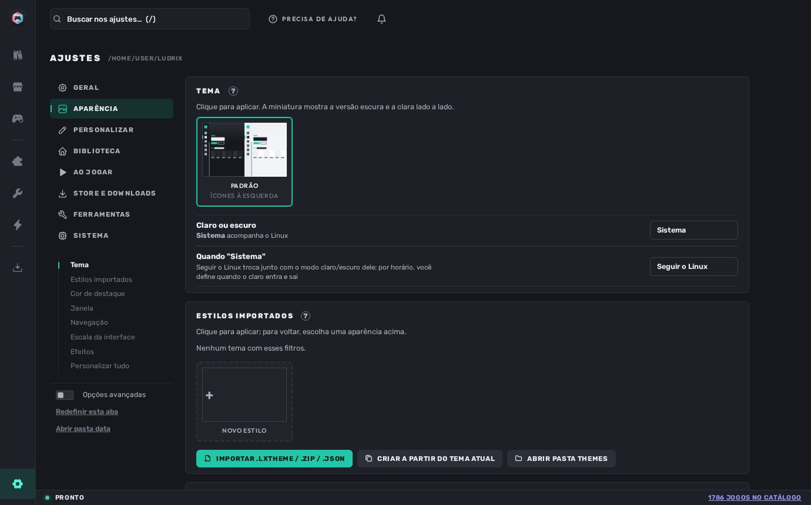
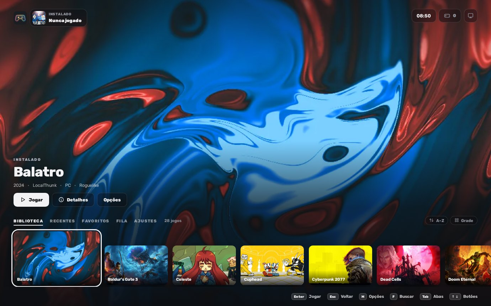
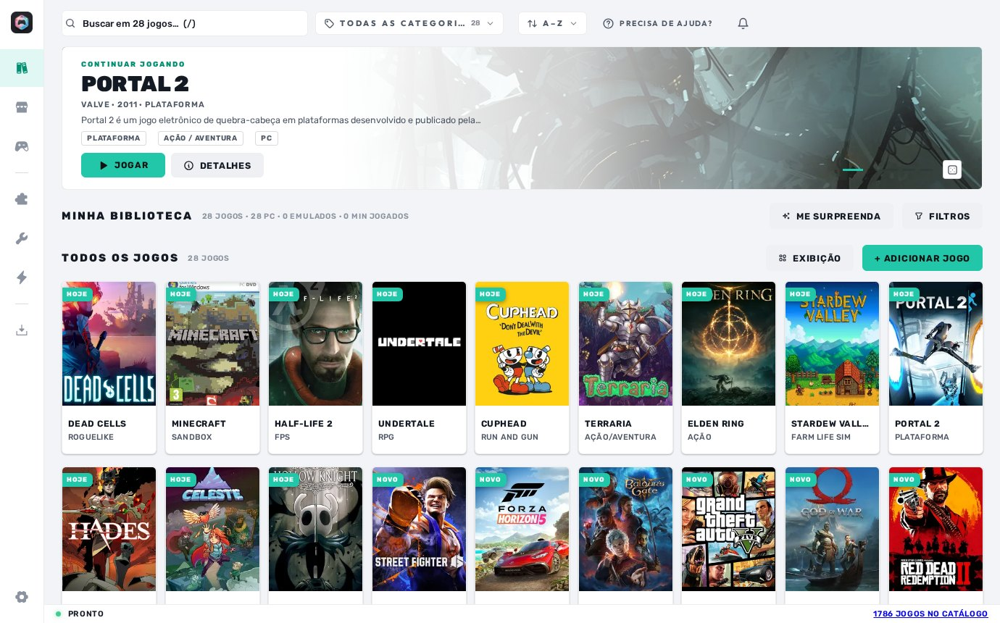
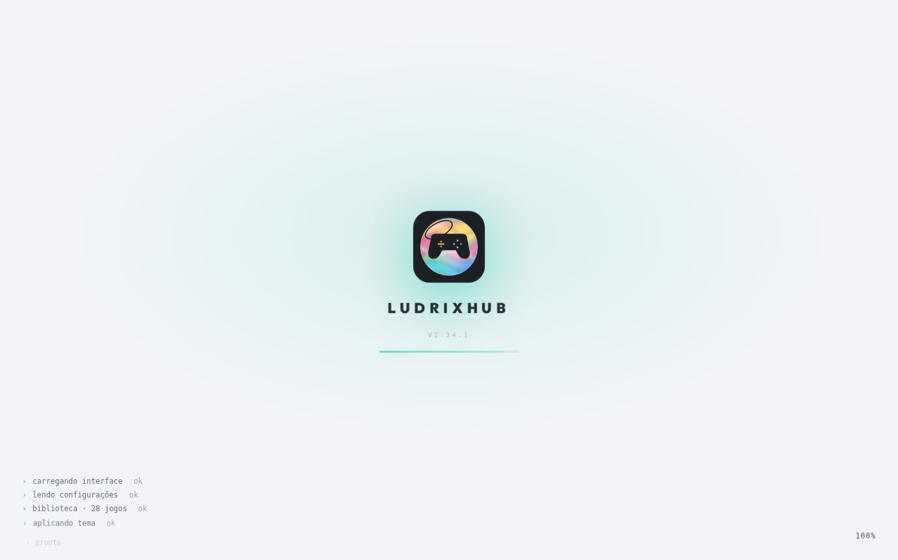
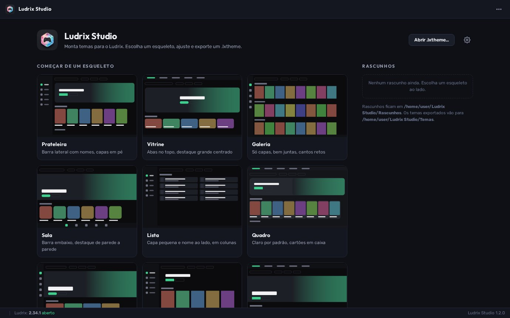

<p align="center">
  
</p>

<h1 align="center">LudrixHub</h1>

<p align="center">
  Launcher de jogos portátil para Windows.<br>
  Biblioteca única para jogos de PC, emulados e rápidos · Store alimentada por listas que você escolhe · emuladores prontos · temas · Modo Console.
</p>

<p align="center">
  <a href="https://github.com/wolffZ-prog/Ludrix/releases/latest"></a>
  <a href="https://github.com/wolffZ-prog/Ludrix/releases"></a>
  
  
  <a href="LICENSE"></a>
</p>

<p align="center">
  <a href="#download">Download</a> ·
  <a href="#o-que-ele-faz">O que ele faz</a> ·
  <a href="#capturas">Capturas</a> ·
  <a href="#fontes-de-jogos">Fontes</a> ·
  <a href="#temas-e-ludrix-studio">Temas</a> ·
  <a href="#compilar">Compilar</a> ·
  <a href="docs/">Documentação</a> ·
  <a href="README.en.md">English</a>
</p>

<p align="center">
  
</p>

---

## Download

| Arquivo | Para quem |
|---|---|
| **`Ludrix-<versão>.zip`** | Programa pronto. Extrai em qualquer pasta (pode ser pendrive) e abre `Ludrix.exe`. Não instala nada no sistema. |
| `ludrix-<versão>-patch.lxup` | Atualização. O Ludrix baixa e aplica sozinho em **Ajustes → Sistema → Checar atualizações**; também dá pra arrastar o arquivo pra janela. |
| `Ludrix-<versão>-src.zip` | Código-fonte desta mesma versão, pra compilar com `build.bat`. |

Última versão: **[Releases](https://github.com/wolffZ-prog/Ludrix/releases/latest)**. Histórico completo em [CHANGELOG.md](CHANGELOG.md).

Requisitos: Windows 10 ou 11, 64 bits. O WebView2 vem embutido no pacote. Nada de conta, login ou cadastro.

## O que ele faz

**Biblioteca**
- Jogos de PC (`.exe`, atalhos, pastas inteiras), ROMs e jogos rápidos (Flash/HTML5) na mesma tela, com capas, categorias, filtros combináveis e busca com prefixos (`dev:`, `ano:`, `gen:`, `sis:`, `origem:`).
- Importa de Playnite, Steam, Epic, GOG, Ubisoft Connect, EA app, Battle.net, Amazon Games e itch.io. Os nomes que você digita nunca são alterados.
- Capas, descrição, ano, desenvolvedora, screenshots e requisitos buscados automaticamente; tudo editável. Compara os requisitos com o seu PC.
- Destaque com os jogos da casa, "Me surpreenda", favoritos, tempo jogado, última sessão, backup automático de saves.
- Clique com o botão direito em qualquer jogo: jogar, abrir pasta, trocar capa, mods, saves, atalho na área de trabalho, verificar arquivos.

**Store por fontes**
- O Ludrix não traz nenhuma fonte de download embutida. Você adiciona listas `.json`, páginas de sites, coleções do archive.org, repositórios do GitHub ou pastas locais — e a Store passa a mostrar o que elas oferecem.
- Baixa por link direto, hospedeiros (MEGA, MediaFire, Pixeldrain, Google Drive, itch.io e outros) ou torrent; downloads em etapas, pausa, fila com histórico.
- Instala o que baixou: extrai `.zip`/`.7z`/`.rar`, roda instaladores, monta imagens de disco, pede atalho na área de trabalho só se você quiser.
- Recompilações e ports nativos (N64, Xbox 360, PS1…) vêm direto do GitHub, sempre na versão mais recente. Lista pronta: [`Recomps.json`](docs/FONTES.md#recomps).

**Emuladores**
- 25 sistemas e 45 emuladores catalogados (PCSX2, DuckStation, PPSSPP, Dolphin, melonDS, Xenia, mGBA, Snes9x, Rosalie's Mupen GUI, Eden…). Instala do site oficial com um clique, tudo portátil dentro da pasta do Ludrix.
- Aponta a pasta de ROMs de cada console e elas entram na Biblioteca. Vários emuladores por sistema; BIOS detectada.

**Central**
- Dependências que quase todo jogo exige (Visual C++, DirectX, .NET, PhysX…): detecta o que falta e instala.
- Modo Game: fecha o supérfluo antes de jogar e restaura depois. Programas úteis via winget e Microsoft Store. Minecraft: detecta o launcher oficial e as alternativas.

**Modo Console**
- Interface separada para TV e controle: capas grandes, navegação por analógico/D-pad, mesmas tabs do launcher. Abre pelo ícone ou automaticamente com controle conectado.

**Aparência**
- Tema claro e escuro, cor de destaque, barra lateral ou inferior, escala adaptativa, intensidade de efeitos. Temas `.lxtheme` importáveis, feitos no [Ludrix Studio](#temas-e-ludrix-studio).
- Interface em português do Brasil e inglês.

**Sistema**
- Portátil de verdade: tudo fica na pasta (`data/`, `games/`, `emulation/`, `downloads/`, `themes/`). Nada é gravado fora dela.
- Bandeja do sistema, iniciar com o Windows (opcional), instância única, autorreparo: cada arquivo do programa é conferido ao abrir e restaurado da própria cópia local se algo foi alterado.
- Atualizações assinadas (Ed25519). Pacote sem assinatura válida não é aplicado. Se uma atualização não abrir duas vezes seguidas, o Ludrix volta sozinho pra versão anterior.
- Exportar e importar a biblioteca inteira (configurações, capas, metadados) em um arquivo.

## Capturas

<table>
  <tr>
    <td><br><sub>Detalhes: descrição, metadados, screenshots, requisitos</sub></td>
    <td><br><sub>Store lendo duas listas .json</sub></td>
  </tr>
  <tr>
    <td><br><sub>Emuladores: instala, aponta ROMs, escolhe o núcleo</sub></td>
    <td><br><sub>Central: dependências, Modo Game, programas úteis</sub></td>
  </tr>
  <tr>
    <td><br><sub>Menu do botão direito</sub></td>
    <td><br><sub>Aparência e temas importados</sub></td>
  </tr>
  <tr>
    <td><br><sub>Modo Console</sub></td>
    <td><br><sub>Tema claro</sub></td>
  </tr>
  <tr>
    <td><br><sub>Abertura</sub></td>
    <td><br><sub>Ludrix Studio</sub></td>
  </tr>
</table>

## Fontes de jogos

A Store só mostra o que as suas fontes trazem. Tipos aceitos em **Store → Fontes**:

| Tipo | Exemplo |
|---|---|
| Lista `.json` (`ludrix-pack/1`) | arquivo local ou link; formato em [docs/FONTES.md](docs/FONTES.md) |
| Página de site | o Ludrix lê a página e lista os jogos que encontrar |
| Coleção ou item do archive.org | link da coleção |
| Repositório do GitHub | releases com build Windows |
| Pasta local | jogos que você já tem em outro disco |
| Listas no formato Hydra | compatível |

Pacotes prontos ficam em cada release: `Colecoes.zip` com **PC Collections**, **ROMs Collection** e **Recomps** (91 recompilações/ports com build Windows, baseado no [Recompendium](https://github.com/Nio03/unricopie)).

## Temas e Ludrix Studio

O Ludrix traz um tema (claro e escuro) e importa temas `.lxtheme` em **Ajustes → Aparência → Importar**. Temas novos são feitos no **Ludrix Studio**, um programa separado do mesmo autor: escolhe um esqueleto entre dez, ajusta 300+ opções com visualização ao vivo e exporta o `.lxtheme`. O Studio não faz parte deste repositório. Detalhes em [docs/TEMAS.md](docs/TEMAS.md).

## Compilar

```bat
git clone https://github.com/wolffZ-prog/Ludrix.git
cd Ludrix
pip install -r requirements.txt
run.bat                      :: abre direto, sem compilar (janela nativa)
python app\main.py --web 8000 :: modo navegador, pra desenvolver
build.bat                    :: gera release\<versão>\Ludrix\ + zips + .lxup
```

Precisa de Python 3.11 a 3.14 e Windows. `build.bat` confere o código, compila `Ludrix.exe`, `LudrixConsole.exe` e `updater.exe`, embute o WebView2 Fixed Version e empacota tudo. Veja [docs/COMPILAR.md](docs/COMPILAR.md).

Estrutura:

```
app/            programa: core/ (Python), ui/ (HTML/CSS/JS), presets/ (catálogos de emuladores, dependências, categorias)
tools/build.py  build, empacotamento, assinatura, feed de atualização, publicação
docs/           documentação
```

## Atualizações

O Ludrix consulta este repositório (`releases/latest/download/ludrix-updates.json`). Quando sai versão nova, avisa; você aceita, ele baixa, confere a assinatura, aplica e reabre. Também dá pra apontar um endereço `https` próprio ou aplicar um `.lxup` manualmente. Mais em [docs/ATUALIZACOES.md](docs/ATUALIZACOES.md).

## Segurança

- Servidor local só em `127.0.0.1`, com token por sessão, checagem de origem e CSP.
- Pacotes de atualização e temas assinados; a chave privada nunca está no código.
- Temas não conseguem carregar nada da internet (`@import`, `url()` externo e similares são removidos).
- Sem telemetria, sem conta, sem anúncios.

Achou um problema? Veja [SECURITY.md](SECURITY.md).

## Contribuir

Issues e pull requests são bem-vindos — leia [CONTRIBUTING.md](CONTRIBUTING.md) antes. Regras curtas: código sem comentários nem docstrings, interface direta e sem narração, nada roda em segundo plano sem o usuário ligar.

## Créditos

**WOLFFZ — criador e idealizador do projeto.**

Bibliotecas: [pywebview](https://github.com/r0x0r/pywebview), [Pillow](https://python-pillow.org/), [requests](https://requests.readthedocs.io/), [py7zr](https://github.com/miurahr/py7zr), [psutil](https://github.com/giampaolo/psutil), [pystray](https://github.com/moses-palmer/pystray), [PyInstaller](https://pyinstaller.org/), [libtorrent](https://libtorrent.org/) / [aria2](https://aria2.github.io/). Ícones baseados em [Tabler Icons](https://tabler.io/icons). Fonte [Rubik](https://fonts.google.com/specimen/Rubik).

Licença [MIT](LICENSE). Os jogos, capas e marcas pertencem aos seus donos; o Ludrix não distribui jogos.
